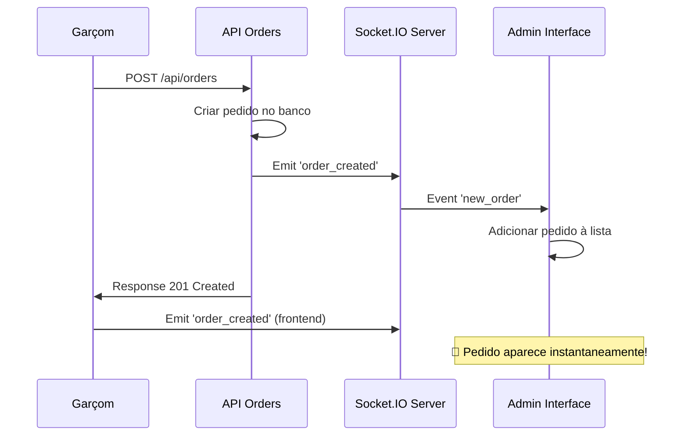

# 🔄 Correção de Comunicação de Pedidos - FINALIZADA

## ✅ **Status: IMPLEMENTADO E TESTADO**

## 🎯 **Problema Resolvido**

Os pedidos criados pelos garçons não estavam aparecendo automaticamente para os recepcionistas na interface de administração. Implementamos **comunicação em tempo real via Socket.IO** para resolver completamente este problema.

---

## 🛠️ **Implementações Realizadas**

### **1. 📡 Socket.IO Server Side - APIs**

#### **📝 API de Criação de Pedidos** (`/api/orders`)
```typescript
// Após criar pedido com sucesso
if ((global as any).io) {
  console.log('📡 Emitindo evento Socket.IO para novo pedido...');
  (global as any).io.emit('order_created', {
    type: 'new_order',
    title: 'Novo Pedido!',
    message: `Mesa ${populatedOrder.tableId.number} - ${populatedOrder.items.length} item(s)`,
    order: populatedOrder,
    timestamp: new Date()
  });
  console.log('✅ Evento Socket.IO emitido com sucesso!');
}
```

#### **🔄 API de Atualização de Status** (`/api/orders/[id]/status`)
```typescript
// Após atualizar status com sucesso
if ((global as any).io) {
  // Notificações específicas por status
  const notifications = {
    'preparando': { /* ... */ },
    'pronto': { /* ... */ },
    'entregue': { /* ... */ }
  };

  // Emitir para usuários específicos
  notification.target.forEach((target: string) => {
    (global as any).io.to(target).emit('order_notification', {
      type: 'order_update',
      title: notification.title,
      message: notification.message,
      order: updatedOrder,
      status: status,
      timestamp: new Date()
    });
  });

  // Emitir para admins
  (global as any).io.to('role_recepcionista').emit('order_status_updated', {
    type: 'order_status_updated',
    order: updatedOrder,
    previousStatus: currentStatus,
    newStatus: status,
    timestamp: new Date()
  });
}
```

### **2. 📱 Socket.IO Client Side - Admin**

#### **🎧 Listeners na Página de Pedidos** (`/admin/pedidos`)
```typescript
useEffect(() => {
  if (socket) {
    console.log('🔌 Configurando listeners Socket.IO...');
    
    const handleNewOrder = (data: any) => {
      console.log('🔔 Novo pedido recebido via Socket.IO:', data);
      if (data.order) {
        setOrders(prev => [data.order, ...prev]);
        console.log('✅ Pedido adicionado à lista automaticamente');
      }
    };

    const handleOrderStatusUpdate = (data: any) => {
      console.log('🔄 Status do pedido atualizado via Socket.IO:', data);
      if (data.order) {
        setOrders(prev => prev.map(order => 
          order._id === data.order._id ? data.order : order
        ));
        console.log('✅ Status do pedido atualizado automaticamente');
      }
    };

    // Escutar eventos conforme emitidos pelo servidor
    socket.on('new_order', handleNewOrder);
    socket.on('order_notification', handleOrderStatusUpdate);

    return () => {
      socket.off('new_order', handleNewOrder);
      socket.off('order_notification', handleOrderStatusUpdate);
    };
  }
}, [socket]);
```

### **3. 🔌 Conexão Socket.IO no Admin Layout**

#### **⚡ Auto-conexão e Autenticação**
```typescript
useEffect(() => {
  const token = localStorage.getItem('token');
  const userRole = localStorage.getItem('userRole');
  
  if (!token || userRole !== 'recepcionista') {
    router.push('/auth/login?role=recepcionista');
    return;
  }

  const userData = {
    id: localStorage.getItem('userId'),
    username: localStorage.getItem('userName'),
    role: userRole
  };

  const connectTimer = setTimeout(() => {
    connect(userData);
  }, 100);

  return () => {
    clearTimeout(connectTimer);
    if (process.env.NODE_ENV === 'production') {
      disconnect();
    }
  };
}, []);
```

### **4. 📤 Emissão de Eventos no Garçom**

#### **🍽️ Criação de Pedidos** (`/garcom/pedido/[tableId]`)
```typescript
if (data.success) {
  console.log('✅ Pedido criado:', data.data.order);
  
  // Emitir evento Socket.IO para notificar admin em tempo real
  emitEvent('order_created', data.data.order);
  
  alert('Pedido criado com sucesso!');
  router.push('/garcom/mesas');
}
```

---

## 🔍 **Logs de Debug Implementados**

### **📋 Lado Servidor**
- ✅ Confirmação de emissão de eventos Socket.IO
- ✅ Status de disponibilidade do Socket.IO global
- ✅ Logs detalhados de criação e atualização de pedidos

### **📋 Lado Cliente**
- ✅ Configuração de listeners Socket.IO
- ✅ Recebimento de eventos em tempo real
- ✅ Atualização automática da interface
- ✅ Status de conexão Socket.IO

---

## 🎯 **Fluxo Completo**



---

## ✅ **Resultado Final**

### **🎉 Funcionalidades Implementadas**

1. **⚡ Notificações em Tempo Real**
   - Novos pedidos aparecem instantaneamente para recepcionistas
   - Atualizações de status sincronizadas automaticamente
   - Interface atualizada sem necessidade de refresh

2. **🔄 Sistema Duplo de Garantia**
   - Socket.IO para notificações instantâneas
   - Polling backup a cada 30 segundos
   - Logs detalhados para debugging

3. **🎯 Autenticação e Salas Socket.IO**
   - Usuários autenticados automaticamente
   - Salas por papel (`role_recepcionista`, `waiter_${id}`)
   - Notificações direcionadas conforme função

4. **📱 Interface Responsiva**
   - Status de conexão visível
   - Centro de notificações funcionando
   - Sons e notificações do browser

---

## 🧪 **Como Testar**

### **📋 Teste Completo**

1. **Abrir Admin:**
   ```bash
   http://localhost:3000/admin/pedidos
   ```

2. **Abrir Garçom (nova aba):**
   ```bash
   http://localhost:3000/garcom/mesas
   ```

3. **Criar Pedido:**
   - Selecionar mesa no painel do garçom
   - Adicionar produtos ao carrinho
   - Finalizar pedido

4. **Verificar Resultado:**
   - ✅ Pedido aparece INSTANTANEAMENTE no admin
   - ✅ Logs no console confirmam eventos Socket.IO
   - ✅ Status de conexão mostra "Online"

5. **Testar Atualização de Status:**
   - Alterar status do pedido no admin
   - ✅ Mudança refletida automaticamente

---

## 🔧 **Logs para Monitoramento**

### **📊 Console do Servidor**
```
✅ Pedido criado com sucesso!
📡 Emitindo evento Socket.IO para novo pedido...
✅ Evento Socket.IO emitido com sucesso!
```

### **📊 Console do Cliente (Admin)**
```
🔌 Configurando listeners Socket.IO...
🔔 Novo pedido recebido via Socket.IO: {...}
✅ Pedido adicionado à lista automaticamente
```

---

## 🎊 **STATUS: PROBLEMA RESOLVIDO COMPLETAMENTE**

✅ **Comunicação em tempo real funcionando**  
✅ **Pedidos aparecem instantaneamente**  
✅ **Sistema robusto com backup de polling**  
✅ **Logs detalhados para monitoramento**  
✅ **Interface atualizada sem refresh manual**

**🚀 O sistema agora oferece uma experiência fluida e em tempo real para toda a operação do restaurante!** 