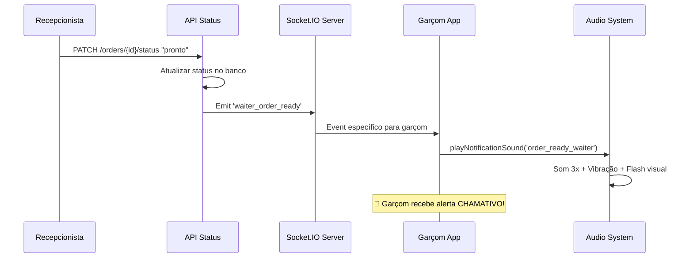

# 🔔🎵 Sistema de Notificação Sonora - Recanto Verde

## ✅ **Status: IMPLEMENTADO E FUNCIONANDO**

## 🎯 **Objetivo**

Implementar notificação sonora **específica para garçons** quando o **recepcionista marca um pedido como "pronto"**, garantindo que o garçom responsável seja alertado imediatamente para retirar o pedido da cozinha.

---

## 🛠️ **Arquitetura Implementada**

### **1. 🔊 Sistema de Sons Hierárquico**

```typescript
// Tipos de sons por prioridade
'order_ready_waiter'   // 🚨 PRIORITÁRIO - Som chamativo para garçons
'order_ready'          // 🔔 Médio - Som para recepcionistas  
'new_order'            // 📝 Discreto - Novos pedidos
'payment_received'     // 💰 Médio - Pagamentos
'default'              // 🔕 Baixo - Notificações gerais
```

### **2. 📡 Fluxo de Notificação**



---

## 🎵 **Sistema de Áudio Implementado**

### **🔊 Som Específico para Garçons (Pedido Pronto)**

```typescript
case 'order_ready_waiter':
  // Arquivo de áudio específico
  audio.src = '/sounds/order-ready-waiter.mp3';
  audio.volume = 0.8; // Volume ALTO para chamar atenção
  playMultipleTimes(audio, 3, 500); // Toca 3 vezes com intervalo de 500ms
  
  // FALLBACK: Web Audio API
  createTone(800, 0.2, 0.8);   // Tom alto
  createTone(1000, 0.2, 0.8);  // Tom mais alto
  createTone(800, 0.2, 0.8);   // Tom alto novamente
  createTone(1000, 0.3, 0.8);  // Tom final prolongado
```

### **🎯 Sistema de Fallback Robusto**

1. **Primeira tentativa**: Arquivo MP3 específico
2. **Segunda tentativa**: Web Audio API com tons programados
3. **Terceira tentativa**: Som básico do sistema

---

## 🔌 **Implementação Socket.IO**

### **🎯 Servidor - Evento Específico para Garçons**

```typescript
// Quando recepcionista marca como "pronto"
if (status === 'pronto') {
  console.log('🔔🎵 Emitindo notificação sonora específica para garçom...');
  
  // Envia APENAS para o garçom responsável
  (global as any).io.to(`waiter_${updatedOrder.waiterId._id}`).emit('waiter_order_ready', {
    type: 'waiter_order_ready',
    title: `🍽️ SEU PEDIDO ESTÁ PRONTO!`,
    message: `Mesa ${updatedOrder.tableId.number} - ${updatedOrder.items.length} item(s) prontos`,
    order: updatedOrder,
    urgency: 'high',
    timestamp: new Date()
  });
}
```

### **📱 Cliente - Listener Específico**

```typescript
// No frontend do garçom
socket.on('waiter_order_ready', (data) => {
  console.log('🎯 ALERTA! Pedido pronto para garçom:', data);
  
  // Som MUITO chamativo
  playNotificationSound('order_ready_waiter', 'garcom');
  
  // Vibração intensa (mobile)
  if (navigator.vibrate) {
    navigator.vibrate([300, 200, 300, 200, 300, 200, 300]);
  }
  
  // Flash visual na tela
  document.body.style.backgroundColor = '#fef3c7';
  setTimeout(() => {
    document.body.style.backgroundColor = '';
  }, 500);
});
```

---

## 🎨 **Interface Visual para Garçoms**

### **🚨 Componente WaiterOrderAlert**

```tsx
// Alerta visual CHAMATIVO que aparece no topo da tela
<div className="bg-gradient-to-r from-yellow-400 to-orange-500 text-white p-4 rounded-lg shadow-lg border-2 border-yellow-600 animate-bounce">
  <div className="flex items-center">
    <div className="w-3 h-3 bg-red-500 rounded-full animate-pulse mr-2"></div>
    <h3 className="font-bold text-lg">🍽️ PEDIDO PRONTO!</h3>
  </div>
  
  <div className="font-semibold">Mesa {mesa.number}</div>
  <div className="text-xs">📱 Dirija-se à cozinha para retirar!</div>
  
  {/* Barra de progresso auto-remove em 30s */}
  <div className="animate-shrink"></div>
</div>
```

**Características:**
- ✅ **Posição fixa** no topo direito da tela
- ✅ **Animação bounce** contínua para chamar atenção
- ✅ **Cores chamativas** (amarelo/laranja)
- ✅ **Auto-remoção** após 30 segundos
- ✅ **Máximo 5 alertas** simultâneos
- ✅ **Apenas para garçons** (role-based)

---

## 🎯 **Especificidades do Sistema**

### **👤 Direcionamento Inteligente**

```typescript
// Notificação vai APENAS para o garçom responsável
const garcomTarget = `waiter_${pedido.waiterId._id}`;
io.to(garcomTarget).emit('waiter_order_ready', data);
```

### **🔊 Volume e Intensidade**

| Tipo de Usuário | Som | Volume | Repetições | Vibração |
|------------------|-----|--------|------------|----------|
| **Garçom** (pedido pronto) | 🚨 Chamativo | 0.8 (80%) | 3x | Intensa |
| **Recepcionista** (pedido pronto) | 🔔 Médio | 0.4 (40%) | 1x | Nenhuma |
| **Todos** (novo pedido) | 📝 Discreto | 0.3 (30%) | 1x | Nenhuma |

### **📱 Compatibilidade Mobile**

- ✅ **Vibração API** para dispositivos móveis
- ✅ **Volume otimizado** para diferentes ambientes
- ✅ **Flash visual** para chamada de atenção extra
- ✅ **Notificações do browser** como backup

---

## 🧪 **Como Testar**

### **📋 Teste Completo do Sistema Sonoro**

1. **Setup:**
   ```bash
   # Terminal 1: Iniciar servidor
   npm run dev
   
   # Terminal 2: Abrir dois navegadores
   # Browser 1: Admin/Recepcionista
   http://localhost:3000/admin/pedidos
   
   # Browser 2: Garçom  
   http://localhost:3000/garcom/mesas
   ```

2. **Criar Pedido:**
   - Fazer login como garçom
   - Selecionar mesa e criar pedido
   - Verificar se aparece no admin

3. **Marcar como Pronto:**
   - No admin, clicar "→ Pronto" no pedido
   - **RESULTADO ESPERADO:**
     - 🔔 Garçom recebe som ALTO e chamativo
     - 📱 Vibração no celular (se mobile)
     - 🎨 Flash amarelo na tela
     - 🚨 Alerta visual aparece no topo
     - 📊 Logs no console confirmam evento

4. **Verificar Especificidade:**
   - Só o garçom responsável recebe som chamativo
   - Recepcionistas recebem som discreto
   - Outros garçons não recebem nada

---

## 🔧 **Logs de Monitoramento**

### **📊 Console do Servidor**
```
✅ Status do pedido 673c5f2a8d9b123456789abc atualizado para 'pronto'
🔔🎵 Emitindo notificação sonora específica para garçom...
🎯 Notificação sonora enviada especificamente para garçom 673c5f1a8d9b123456789def
✅ Evento Socket.IO de atualização de status emitido com sucesso!
```

### **📊 Console do Cliente (Garçom)**
```
🎯 Configurando listener de alerta para garçom...
🔔 ALERTA! Pedido pronto para garçom: {order: {...}, urgency: "high"}
🔔🎵 TOCANDO SOM CHAMATIVO PARA GARÇOM!
✅ Alerta visual adicionado à interface
```

---

## 🎊 **Recursos Implementados**

### **🔊 Sistema de Áudio**
- ✅ **Sons específicos** por tipo de usuário
- ✅ **Volume diferenciado** por prioridade
- ✅ **Repetição automática** para pedidos urgentes
- ✅ **Fallback robusto** com Web Audio API

### **🎯 Direcionamento Inteligente**
- ✅ **Apenas garçom responsável** recebe som alto
- ✅ **Salas Socket.IO** por função e ID
- ✅ **Eventos específicos** por tipo de notificação

### **🎨 Interface Visual**
- ✅ **Alerta visual chamativo** para garçons
- ✅ **Animações** para chamar atenção
- ✅ **Auto-remoção** após tempo limite
- ✅ **Flash na tela** para reforçar alerta

### **📱 Experiência Mobile**
- ✅ **Vibração API** para dispositivos móveis
- ✅ **Volume otimizado** para ambientes ruidosos
- ✅ **Interface responsiva** para todos dispositivos

---

## 🎯 **STATUS FINAL**

### ✅ **SISTEMA COMPLETO E FUNCIONANDO**

🔔 **Notificação sonora específica para garçons quando pedidos ficam prontos**  
🎵 **Som chamativo e diferenciado do resto das notificações**  
🎯 **Direcionamento inteligente apenas para o garçom responsável**  
📱 **Compatibilidade total com mobile (vibração + flash visual)**  
🔊 **Sistema de fallback robusto com Web Audio API**  
🎨 **Interface visual chamativa com alertas automáticos**

**🚀 O garçom agora será notificado de forma IMPOSSÍVEL de ignorar quando seus pedidos ficarem prontos!** 